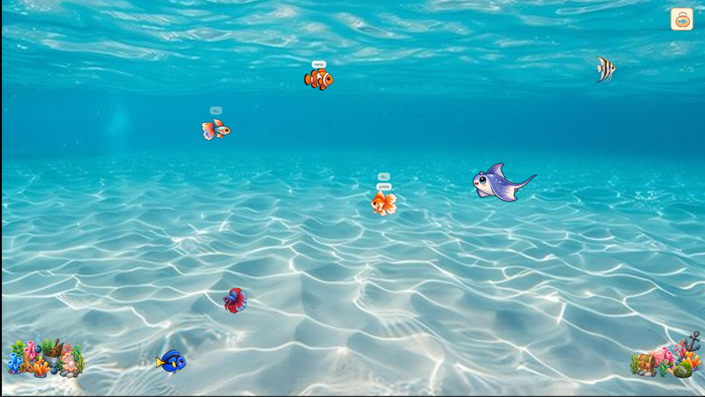

# DesktopAquarium

DesktopAquarium is a lightweight Windows desktop aquarium and desktop-pet application that adds animated fish, decorations, feeding, fishing, bubbles, and interactive aquarium behavior directly to your desktop.

  

  <em>Note: The background wallpaper shown in the screenshot is not included. DesktopAquarium is an overlay that appears on top of your existing desktop.</em>

  

> This repository is for public DesktopAquarium downloads and release information only.

## Download and Install

### Recommended: Windows Installer

Click the download button above. Then:
1. Run the installer.
2. Follow the installation steps.
3. Launch DesktopAquarium from the Start Menu or Desktop shortcut.

The packaged release is self-contained and intended for normal users. It does not require Visual Studio or the .NET SDK.

### Portable Version

If you prefer not to install DesktopAquarium, download:

`DesktopAquarium-1.2.0-Portable-win-x64.zip`

Extract the entire ZIP, then run:

`DesktopAquarium.exe`

Keep all included files together.

### Release Assets

The v1.2.0 release is expected to include:

- `DesktopAquarium-1.2.0-Setup.exe`
- `DesktopAquarium-Setup.exe` — recommended installer and stable latest-release filename
- `DesktopAquarium-1.2.0-Portable-win-x64.zip`
- `SHA256SUMS.txt`

## Features

- Animated desktop fish in a transparent desktop overlay with click-through empty areas
- Lock Aquarium mode for click-through fish and decorations
- Fish feeding, multiple simultaneous Fishing Rods, and feeding while active rods remain in place
- Fish naming, cursor-follow behavior, and animated chat, emotion, and bubble effects
- Persistent fish health and hunger, including Weak, Critical, starvation, Overfed, and Severely overfed states
- Fish death and sinking behavior with reactions such as `x.x`, `ded`, or `💀`
- Movable fish and decorations, with multi-selection and batch removal for both
- Guppy and large fish including Shark, Whale, and Stingray
- Optional temporary large-fish events after sustained active work
- Multi-monitor support
- System tray controls and persistent aquarium settings

## System Requirements

- Windows 10 or Windows 11
- 64-bit Windows

The packaged release is self-contained and does not require the .NET SDK.

## Windows SmartScreen

DesktopAquarium is currently unsigned, so Windows SmartScreen may display a warning when running a newly downloaded installer. Review the downloaded file before deciding whether to run it. Do not disable Windows Defender, SmartScreen, or antivirus protection globally.

## Current Version
**v1.2.0**

## Developer

Developed by **nichi**
Copyright © 2026 nichi

## Releases

Application installers and portable builds are available from this repository's GitHub Releases page rather than committed to its normal Git history.
The repository files themselves do not contain the DesktopAquarium application source code.

[View all releases](https://github.com/Nichinx/DesktopAquarium-distributable/releases)
